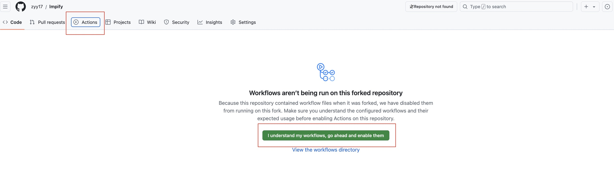
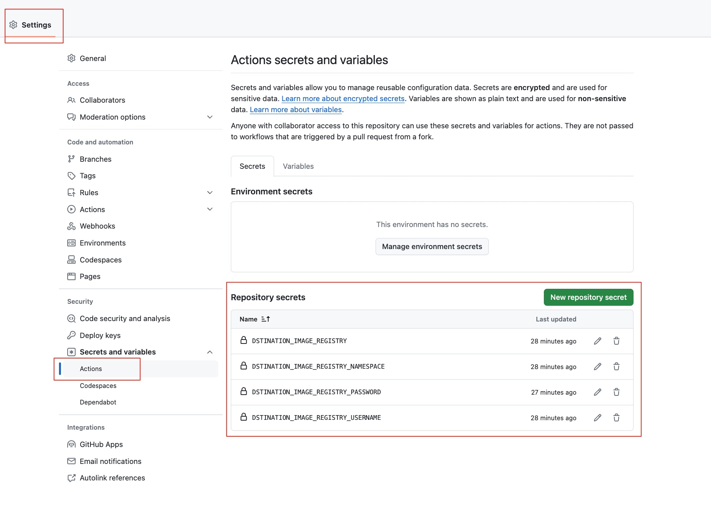

# 什么是 `lmpify`

`lmpify` = **Let Me Pull Images For You**.

## 原理

原理比较简单，就是通过 GitHub Actions 来帮我们拉取镜像并推送到中国大陆境内的镜像仓库中，客户端则通过拉取国内的镜像和 Docker Tag 操作来方便使用。

这种方案相对比较简单且**基本免费**（使用量**不要超过**相应云服务的免费额度即可），对当前客户端配置无侵入性，比较适合一般性的开发使用。

## 如何使用

### 前提条件

1. **拥有一个中国大陆境内的镜像仓库**

   比如可申请[阿里云免费版个人仓库](https://help.aliyun.com/zh/acr/?spm=a2c4g.11186623.0.0.5004379dlzrX7s)（或者其他同类服务），并创建相应的命名空间，为方便使用，默认可以设置为**公开**，并配置 credentials；

2. **本地环境必须安装以下工具**

   - **`gh`**：这是 GitHub CLI，用于触发 GitHub Actions（默认本地环境能够正常使用 `gh` 命令），可以参考 [文档](https://cli.github.com/) 进行安装；
   - **`docker`**
   - **`jq`**

### 使用步骤

1. **Fork 本项目并允许其 GitHub Actions 的运行**

   由于 GitHub Actions 默认不会运行 Fork 项目的 Actions，因此需要在 Fork 项目的 `Actions` 选项卡中点击 `I understand my workflows, go ahead and enable them` 来启用 Actions，如下图所示：

   

2. **给自己的 `lmpify` 项目配置 Secrets 变量**

     - `DSTINATION_IMAGE_REGISTRY`: 默认的**目标仓库地址**，比如 `registry.cn-hangzhou.aliyuncs.com`；
     - `DSTINATION_IMAGE_REGISTRY_NAMESPACE`: 默认的**目标仓库命名空间**，比如 `lmpify`；
     - `DSTINATION_IMAGE_REGISTRY_USERNAME`: 目标镜像仓库的**用户名**；
     - `DSTINATION_IMAGE_REGISTRY_PASSWORD`: 目标镜像仓库的**密码**；

   以上变量可以在 `Settings` -> `Security` -> `Secrets and variables` -> `Actions` -> `New repository secret` 中添加，如下图所示：

   

3. **执行安装命令**

   ```console
   curl -sSL https://raw.githubusercontent.com/lmpify/lmpify/main/install.sh | bash -s -- \
     --username <your-github-username> \
     --registry <your-registry> \
     --namespace <your-registry-namespace>
   ```
   
   其中：

   - `--username` 为你的 GitHub 用户名；
   - `--registry` 为你自己**目标镜像仓库地址**，比如 `registry.cn-hangzhou.aliyuncs.com`；
   - `--namespace` 为你自己**目标镜像仓库命名空间**，比如 `lmpify`；
   
   该命令**仅会**将 `lmpify.sh` 下载到 `${HOME}/.lmpify` 目录中，并为对应的 shell 配置文件添加 `lmpify` 命令的 alias。

4. **使用 `lmpify` 命令拉取镜像**

   使用 `lmpify` 命令之前请记得 `source` 对应的 shell 配置文件：

   ```console
   lmpify ubuntu:22.04 && docker run -it ubuntu:22.04 bash
   ```
   
   如果你是使用类似于 [`kind`](https://kind.sigs.k8s.io/docs/user/quick-start/) 一类的工具，可使用 `kind load` 命令加载本地镜像或者使用 [Local Registry](https://kind.sigs.k8s.io/docs/user/local-registry/) 将镜像推送至本地镜像仓库中。

### 如何卸载

执行 `lmpify` 项目的 `uninstall.sh` 脚本即可：

```console
curl -sSL https://raw.githubusercontent.com/lmpify/lmpify/main/uninstall.sh | bash
```

该命令将会：

- **删除** `${HOME}/.lmpify` 目录；
- **清除** shell 配置文件中的 `lmpify` 命令 alias；

## 缺点

1. **速度相对较慢**

   这点显而易见。由于不是直接使用网络代理的方式，镜像的拉取其实是周转了几次，因此速度会受到一定的影响。不过实际使用下来，速度还是可被接受的。

2. **对本地网络有一定要求**

   自动化的使用需要通过 `gh` 来触发 GitHub Actions，因此本地的 terminal 需要能相对（但对网络质量的要求不会太高，可使用一些 GitHub API 代理服务）正常使用 `gh` 命令。
